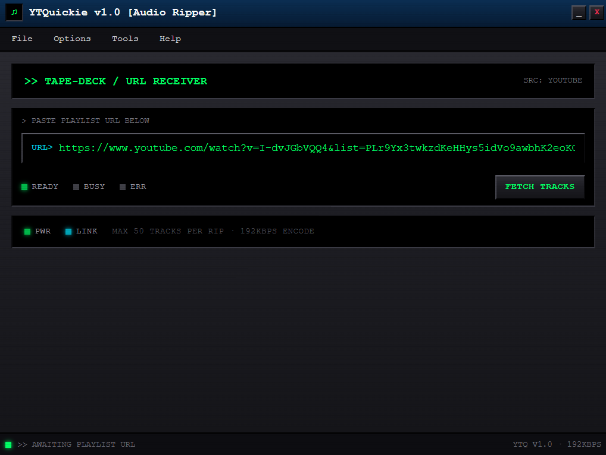
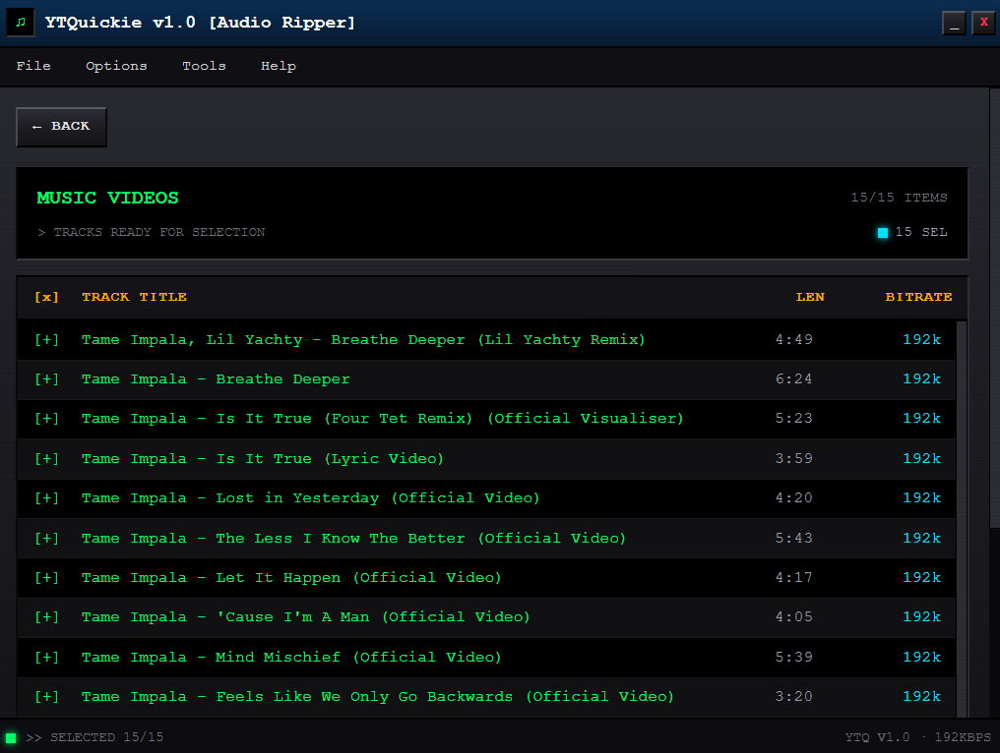
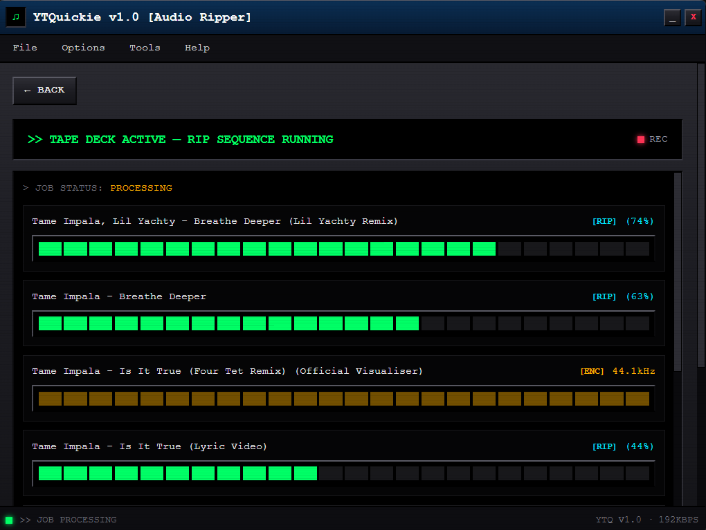
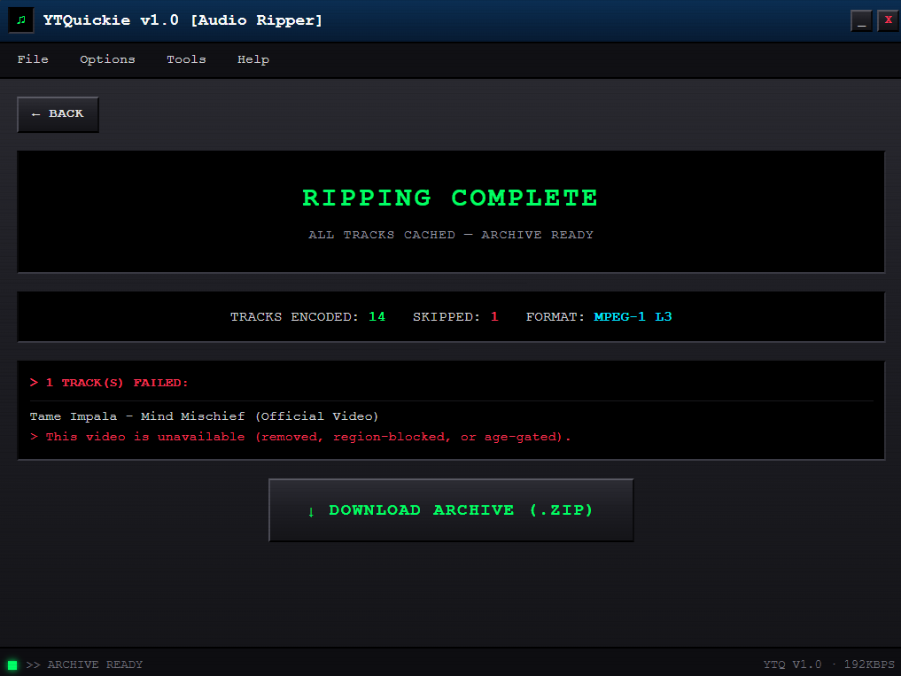

# YTQuickie

A retro-styled YouTube **playlist → MP3** ripper that runs as a frameless desktop app (pywebview/WebView2) with a FastAPI + React backend.

> Paste a playlist URL, pick your tracks, and rip them as **192kbps MP3s** with a CRT terminal vibe — all packed into a single download.

<p align="center">
  
</p>

## Features

- **Paste & rip** — paste any YouTube playlist URL, fetch track metadata instantly.
- **Track selector** — preview the playlist and hand-pick up to **50 tracks** (or select all).
- **Concurrent ripping** — up to 4 tracks at once via yt-dlp, encoded to 192kbps MP3 (FFmpeg).
- **Live progress** — SSE-streamed per-track status with retro segment-bar progress: `RIP → ENC → OK`.
- **Single archive** — finished tracks are bundled into one `.zip` and saved via a native save dialog.
- **Frameless desktop shell** — pywebview window with the retro UI edge-to-edge (drag from the title bar, minimize / close buttons, resizable from 820×620).

## Tech Stack

| Layer       | Tech                                                              |
|-------------|-------------------------------------------------------------------|
| Backend     | Python · FastAPI · yt-dlp · SSE (server-sent events) mixed |
| Frontend    | React · Vite · Tailwind CSS                                       |
| Desktop     | pywebview (Microsoft Edge WebView2)                               |

## Screenshots

<p align="center">
  <br>
  <br>
  
</p>

## Getting Started

### Prerequisites

- [Python 3.11+](https://www.python.org/downloads/)
- [Node.js 18+](https://nodejs.org/)
- [FFmpeg](https://ffmpeg.org/) on your PATH (used for MP3 encoding)
- Microsoft Edge WebView2 runtime (preinstalled on Windows 10/11)

### Desktop app (recommended)

```bash
# 1. Build the frontend (outputs to backend/static)
cd frontend
npm install
npm run build

# 2. Install Python deps
cd ../backend
pip install -r requirements.txt

# 3. Launch the desktop app
python desktop.py
```

### Browser dev mode

```bash
# Terminal 1 — frontend dev server
cd frontend
npm install
npm run dev

# Terminal 2 — API backend (serves the built frontend at :8000 too)
cd backend
pip install -r requirements.txt
uvicorn main:app --reload --port 8000
```

Then open `http://localhost:5173` (or `http://localhost:8000` after `npm run build`).

## Project Structure

```
YTQ/
├── backend/
│   ├── main.py          # FastAPI app: fetch, jobs, SSE stream, download, static serving
│   ├── desktop.py       # pywebview launcher: frameless window + native save dialog
│   ├── static/          # Built React app (generated by `npm run build`)
│   └── requirements.txt
├── frontend/
│   ├── src/App.jsx      # Retro React UI (input → preview → rip → download)
│   ├── src/index.css    # CRT/bevel styling (Tailwind)
│   ├── vite.config.js   # Builds into ../backend/static
│   └── package.json
└── screenshots/         # README screenshots
```

## How It Works

1. **Fetch** — `POST /api/playlist/fetch` pulls playlist metadata with yt-dlp (flat extraction, no download).
2. **Select** — the playlist is rendered as a retro track list; tick tracks you want (max 50).
3. **Rip** — `POST /api/jobs` spins up a background job that downloads/encodes tracks concurrently (4 at a time), streaming `track_update` events over SSE.
4. **Archive** — done tracks are zipped; the desktop app saves the archive through a native save dialog via the pywebview JS bridge.

## Notes & Limitations

- Max **50 tracks** per rip (capped to keep session durations sane).
- Private, age-restricted, or removed videos are skipped and reported on the download screen.
- Downloaded files are kept in `~/.ytquickie/downloads` and cleaned up **1 hour** after a job completes.
- The window itself is non-resizable-by-layout by design; it can be resized (min 820×620) with the content scrolling internally.
